<!--
  Profil README — TM Veri Agustian (@verifydream)
  Gaya: profesional, ringkas, interaktif, dan bisa di-scan cepat recruiter.
  Catatan: Ubah link Repo/Demo sesuai punyamu.
-->

<!-- Hero header dengan animasi -->

  

  
  
  

  

---

### 👋 Ringkas
Lulusan **Sistem Informasi (IPK 3.81/4.00)**, fokus **full-stack web/mobile** dan **rekayasa AI**. Selesai **AI Engineer (Microsoft elevAIte, 2025)**. Terbiasa membangun sistem end-to-end (React/React Native, Node.js/Express, Kotlin Android, Python) dengan performa dan DX yang rapi.

- 🚀 **Impact highlights**:
  - Otomasi ekstraksi PDF→Excel (Python/Tabula) dari jam → **<5 menit**/dokumen.
  - Sistem e-commerce digital goods: **93%** percepatan proses & **4×** transaksi harian.
  - Inventaris aset berbasis QR (Node.js) mempercepat audit **70%**.

---

### 🧰 Tech Stack

  
  
  
  
  
  
  
  

---

### 🏗️ Proyek Unggulan
| Proyek | Deskripsi Singkat | Stack | Link |
|---|---|---|---|
| **Kids Zone Parental Control (Android)** | Kontrol orang tua: app blocker, time limit, pass-gate, dashboard; survei pengguna → **90%** puas | Kotlin (Android Studio) | [Repo](#) • [Demo](#) |
| **E-commerce Digital Goods** | Full-stack untuk komunitas game; otomatisasi PayPal & delivery digital → **93%** lebih cepat | React, Node/Express, Supabase | [Repo](#) • [Demo](#) |
| **Frontdesk Broadcasting System** | Sistem informasi internal 5 seksi → efisiensi distribusi info **+40%** | PHP Native, MySQL | [Repo](#) |
| **IT Asset Inventory QR** | Audit & tracking aset **+70%** cepat, akurasi mendekati **100%** | Node.js, QR, MySQL | [Repo](#) |
| **Smart Productivity Assistant** | 20+ REST API; model AI klasifikasi aktivitas suara (**~85%** akurasi) | Node.js, Python | [Repo](#) |

---

### 🎮 Mini-Game: Pilih Petualangan Dev-mu

---

### 📊 Stats & Trophies

  
  

  

  

  
📈 Weekly Metrics (auto-update)

  

---

### 🧾 Sertifikasi
- **AI Engineer Career Path** — Microsoft elevAIte (2025).  
- **Google Data Analytics** — Coursera.  
- **Front-End & Back-End** — Dicoding (2022).

---

### 🤝 Kontak & Kolaborasi
- ✉️ **Email**: <a href="mailto:tmveriagustian@gmail.com">tmveriagustian@gmail.com</a>  
- 💼 **LinkedIn**: <a href="https://www.linkedin.com/in/tmveriagustian/">/in/tmveriagustian</a>  
- 🕒 Zona waktu: **Asia/Jakarta (WIB)**

  

---

<!-- Footer tip -->

  Made with ❤️ • If you like my work, consider ⭐ starring the repos.

